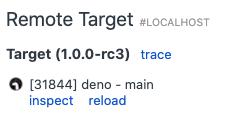
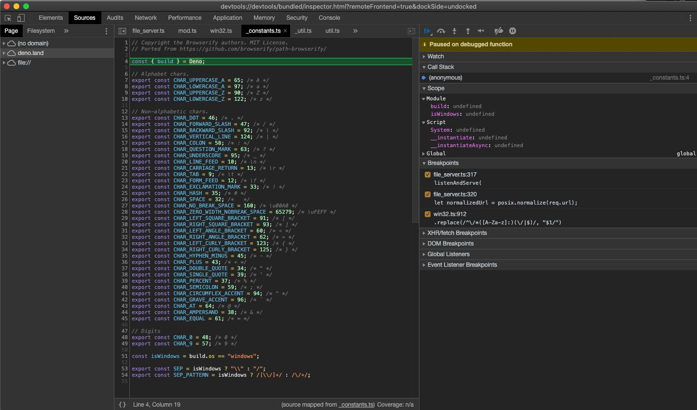
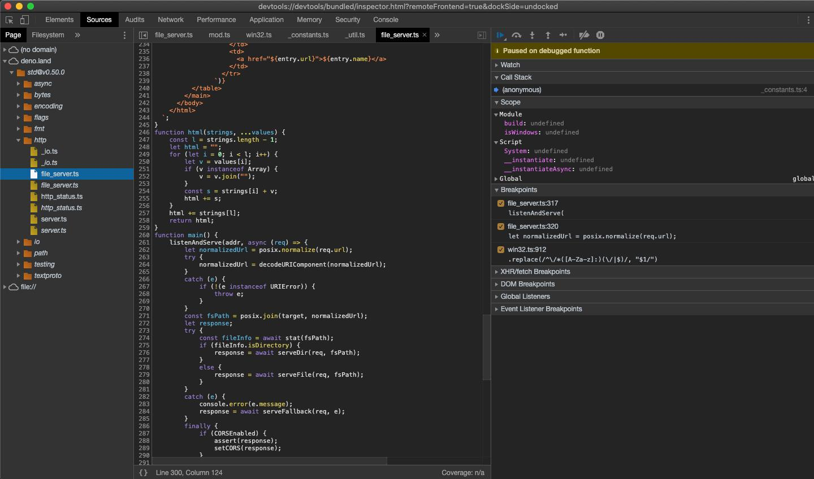

<!-- L1..1
## Debugging your code
-->

## コードをデバッグする

<!-- L3..3
Deno supports the [V8 Inspector Protocol](https://v8.dev/docs/inspector).
-->

Deno は [V8 インスペクタープロトコル](https://v8.dev/docs/inspector)をサポートしています。

<!-- L5..6
It's possible to debug Deno programs using Chrome Devtools or other clients that
support the protocol (eg. VSCode).
-->

Deno のプログラムは Chrome Devtools やこのプロトコルをサポートしているクライアント（VSCode など）を使ってデバッグできます。

<!-- L8..9
To activate debugging capabilities run Deno with the `--inspect` or
`--inspect-brk` flags.
-->

デバッグ機能が有効化するには `--inspect` フラグや `--inspect-brk` フラグをつけて Deno を実行します。

<!-- L11..13
The `--inspect` flag allows attaching the debugger at any point in time, while
`--inspect-brk` will wait for the debugger to attach and will pause execution on
the first line of code.
-->

`--inspect` フラグは任意の時点でデバッガーをアタッチできます。`--inspect-brk` はデバッガーがアタッチするのを待って、コードの最初の行で実行を一時停止します。

<!-- L15..15
### Chrome Devtools
-->

### Chrome Devtools

<!-- L17..19
Let's try debugging a program using Chrome Devtools. For this, we'll use
[file_server.ts](https://deno.land/std@$STD_VERSION/http/file_server.ts) from
`std`, a static file server.
-->

Chrome Devtools を使ってプログラムをデバッグしてみましょう。`std` から静的ファイルサーバーの [file_server.ts](https://deno.land/std@$STD_VERSION/http/file_server.ts) を使うことにします。

<!-- L21..21
Use the `--inspect-brk` flag to break execution on the first line:
-->

`--inspect-brk` フラグを使って最初の行で実行を停止します。

<!-- L23..29
```shell
$ deno run --inspect-brk --allow-read --allow-net https://deno.land/std@$STD_VERSION/http/file_server.ts
Debugger listening on ws://127.0.0.1:9229/ws/1e82c406-85a9-44ab-86b6-7341583480b1
Download https://deno.land/std@$STD_VERSION/http/file_server.ts
Compile https://deno.land/std@$STD_VERSION/http/file_server.ts
...
```
-->

```shell
$ deno run --inspect-brk --allow-read --allow-net https://deno.land/std@$STD_VERSION/http/file_server.ts
Debugger listening on ws://127.0.0.1:9229/ws/1e82c406-85a9-44ab-86b6-7341583480b1
Download https://deno.land/std@$STD_VERSION/http/file_server.ts
Compile https://deno.land/std@$STD_VERSION/http/file_server.ts
...
```

<!-- L31..31
Open `chrome://inspect` and click `Inspect` next to target:
-->

`chrome://inspect` を開いて Target の隣の `Inspect` をクリックします。

<!-- L33..33

-->


<!-- L35..35
It might take a few seconds after opening the Devtools to load all modules.
-->

Devtools を開いてからすべてのモジュールを読み込むまで数秒かかるかもしれません。

<!-- L37..37

-->


<!-- L39..42
You might notice that Devtools paused execution on the first line of
`_constants.ts` instead of `file_server.ts`. This is expected behavior and is
caused by the way ES modules are evaluated by V8 (`_constants.ts` is left-most,
bottom-most dependency of `file_server.ts` so it is evaluated first).
-->

Devtools が `file_server.ts` でなく `_constants.ts` の最初の行で実行を停止したことにお気づきかもしれません。
これは期待された挙動で、ES モジュールが V8 に評価される仕組みにより起きます（`_constants.ts` が `file_server.ts` の依存関係の最も左下にあるため最初に評価されるからです）。

<!-- L44..46
At this point all source code is available in the Devtools, so let's open up
`file_server.ts` and add a breakpoint there; go to "Sources" pane and expand the
tree:
-->

この時点ですべてのソースコードが Devtools 内で利用可能になります。`file_server.ts` を開いてブレークポイントをそこに追加しましょう。「Sources」ペインを開いてツリーを開きます。

<!-- L48..48

-->


<!-- L50..53
_Looking closely you'll find duplicate entries for each file; one written
regularly and one in italics. The former is compiled source file (so in the case
of `.ts` files it will be emitted JavaScript source), while the latter is a
source map for the file._
-->

_よく見ると各ファイルに２つの表示があることがわかります。一つは通常の字体で、もう一つはイタリック体です。前者はコンパイル済みのソースファイル（`.ts` ファイルの場合には JavaScript ソースが送信されます）で、後者はファイルのソースマップです。_

<!-- L55..55
Next, add a breakpoint in the `listenAndServe` method:
-->

次に、`listenAndServe` メソッドの中にブレークポイントを置きます。

<!-- L57..57

-->


<!-- L59..61
As soon as we've added the breakpoint Devtools automatically opened up the
source map file, which allows us step through the actual source code that
includes types.
-->

ブレークポイントを置くとただちに Devtools が自動的にソースマップファイルを開き、型を含む実際のソースコードを見て回ることができるようになります。

<!-- L63..65
Now that we have our breakpoints set, we can resume the execution of our script
so that we might inspect an incoming request. Hit the Resume script execution
button to do so. You might even need to hit it twice!
-->

これでブレークポイントを設置したので、スクリプトの実行を再開してリクエストを観察できます。
Resume script execution ボタンを押してください。二度押す必要があるかもしれません！

<!-- L67..68
Once our script is running again, let's send a request and inspect it in
Devtools:
-->

スクリプトの実行を再開したら、リクエストを送って Devtools で確認してみましょう。

<!-- L70..72
```
$ curl http://0.0.0.0:4500/
```
-->

```
$ curl http://0.0.0.0:4500/
```

<!-- L74..74

-->


<!-- L76..77
At this point we can introspect the contents of the request and go step-by-step
to debug the code.
-->

これでリクエストの中身を確認できます。ステップごとにコードをデバッグできるようになりました。

<!-- L79..79
### VSCode
-->

### VSCode

<!-- L81..81
Deno can be debugged using VSCode.
-->

Deno は VSCode を使ったデバッグができます。

<!-- L83..84
Official support via the plugin is being worked on -
https://github.com/denoland/vscode_deno/issues/12
-->

プラグインによる公式サポートは作業中です。 - https://github.com/denoland/vscode_deno/issues/12

<!-- L86..88
We can still attach the debugger by manually providing a
[`launch.json`](https://code.visualstudio.com/docs/editor/debugging#_launch-configurations)
config:
-->

現在は手動で [`launch.json`](https://code.visualstudio.com/docs/editor/debugging#_launch-configurations) という設定ファイルを手動で置くことでデバッガーをアタッチできます。

<!-- L90..105
```json
{
  "version": "0.2.0",
  "configurations": [
    {
      "name": "Deno",
      "type": "pwa-node",
      "request": "launch",
      "cwd": "${workspaceFolder}",
      "runtimeExecutable": "deno",
      "runtimeArgs": ["run", "--inspect-brk", "-A", "${file}"],
      "attachSimplePort": 9229
    }
  ]
}
```
-->

```json
{
  "version": "0.2.0",
  "configurations": [
    {
      "name": "Deno",
      "type": "pwa-node",
      "request": "launch",
      "cwd": "${workspaceFolder}",
      "runtimeExecutable": "deno",
      "runtimeArgs": ["run", "--inspect-brk", "-A", "${file}"],
      "attachSimplePort": 9229
    }
  ]
}
```

<!-- L107..108
**NOTE**: This uses the file you have open as the entry point; replace `${file}`
with a script name if you want a fixed entry point.
-->

**注意**: これにはエントリーポイントとして開くファイルが必要です。エントリーポイントを固定したい場合は `${file}` をスクリプト名に書き換えてください。

<!-- L110..110
Let's try out debugging a local source file. Create `server.ts`:
-->

ローカルのソースファイルをデバッグしてみましょう。`server.ts` を以下のように作成します。

<!-- L112..120
```ts
import { serve } from "https://deno.land/std@$STD_VERSION/http/server.ts";
const server = serve({ port: 8000 });
console.log("http://localhost:8000/");

for await (const req of server) {
  req.respond({ body: "Hello World\n" });
}
```
-->

```ts
import { serve } from "https://deno.land/std@$STD_VERSION/http/server.ts";
const server = serve({ port: 8000 });
console.log("http://localhost:8000/");

for await (const req of server) {
  req.respond({ body: "Hello World\n" });
}
```

<!-- L122..122
Then we can set a breakpoint, and run the created configuration:
-->

これでブレークポイントを置けるようになりました。作成済みの設定を実行してください。

<!-- L124..124

-->


<!-- L126..126
### JetBrains IDEs
-->

### JetBrains IDEs

<!-- L128..132
You can debug Deno using your JetBrains IDE by right-clicking the file you want
to debug and selecting the `Debug 'Deno: <file name>'` option. This will create
a run/debug configuration with no permission flags set. To configure these flags
edit the run/debug configuration and modify the `Arguments` field with the
required flags.
-->

You can debug Deno using your JetBrains IDE by right-clicking the file you want
to debug and selecting the `Debug 'Deno: <file name>'` option. This will create
a run/debug configuration with no permission flags set. To configure these flags
edit the run/debug configuration and modify the `Arguments` field with the
required flags.

<!-- L134..134
### Other
-->

### Other

<!-- L136..137
Any client that implements the Devtools protocol should be able to connect to a
Deno process.
-->

Any client that implements the Devtools protocol should be able to connect to a
Deno process.

<!-- L139..139
### Limitations
-->

### Limitations

<!-- L141..142
Devtools support is still immature. There is some functionality that is known to
be missing or buggy:
-->

Devtools support is still immature. There is some functionality that is known to
be missing or buggy:

<!-- L144..145
- autocomplete in Devtools' console causes the Deno process to exit
- profiling and memory dumps might not work correctly
-->

- autocomplete in Devtools' console causes the Deno process to exit
- profiling and memory dumps might not work correctly
